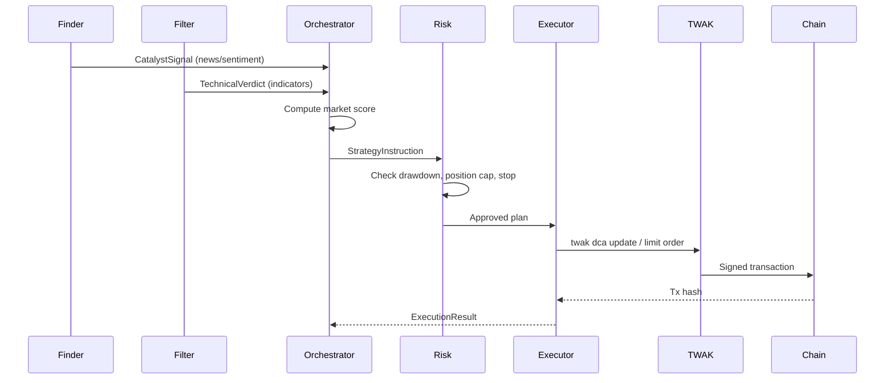

# 🤖 Sentient DCA Agent

**Adaptive AI‑powered Dollar‑Cost Averaging on BNB Chain**  
*Winner‑ready submission for BNB Hack: AI Trading Agent Edition (CoinMarketCap × Trust Wallet)*

[](https://opensource.org/licenses/MIT)
[](https://www.python.org/downloads/)
[](https://trustwallet.com)
[](https://bnbchain.org)

---

## 📑 Table of Contents
1. [Vision & Problem Statement](#vision--problem-statement)
2. [What Makes Sentient DCA Unique](#what-makes-sentient-dca-unique)
3. [System Architecture](#system-architecture)
4. [Technical Stack](#technical-stack)
5. [Multi‑Agent Breakdown](#multiagent-breakdown)
6. [Unbreakable Risk Management](#unbreakable-risk-management)
7. [Reasoning Logs & Transparency](#reasoning-logs--transparency)
8. [Installation & Setup](#installation--setup)
9. [Configuration Guide](#configuration-guide)
10. [Running the Agent](#running-the-agent)
11. [Monitoring & Dashboard](#monitoring--dashboard)
12. [Competition Compliance](#competition-compliance)
13. [Project Structure](#project-structure)
14. [API Reference](#api-reference)
15. [Testing & Backtesting](#testing--backtesting)
16. [Future Roadmap](#future-roadmap)
17. [Contributing & License](#contributing--license)

---

## 🎯 Vision & Problem Statement

**The Problem**  
Retail investors repeatedly fall into the same trap: they **buy high, sell low** driven by fear and greed. Even those who adopt Dollar‑Cost Averaging (DCA) often abandon it during sharp drawdowns or FOMO rallies. Existing “smart DCA” bots are rigid – they cannot adapt to real‑time market sentiment, funding rates, or volatility, and most require surrendering private keys, breaking self‑custody.

**Our Solution – Sentient DCA Agent**  
An autonomous, self‑custodial AI agent that **dynamically adjusts DCA frequency and amount** based on live market intelligence from CoinMarketCap, while enforcing **hard‑coded circuit breakers** that the AI itself cannot override. The agent publishes a **full chain‑of‑thought reasoning log** for every decision, making its logic transparent and auditable.

> **One‑line pitch:**  
> *Sentient DCA solves emotional investing by using an AI that adapts DCA to market conditions while enforcing unbreakable risk rules the AI cannot override.*

---

## ✨ What Makes Sentient DCA Unique

| Feature | Traditional Bot | Sentient DCA Agent |
|---------|----------------|---------------------|
| **DCA adaptation** | Fixed schedule | Dynamic frequency & amount based on sentiment, funding, volatility |
| **Market data** | Free, delayed API | Real‑time x402 micropayments (CMC Agent Hub) |
| **AI reasoning** | Rule‑based | ReflAct (Reflection + Planning) LLM, full chain‑of‑thought logs |
| **Risk management** | Optional, soft | Hard circuit breakers (drawdown, position cap, ATR stops) – AI cannot override |
| **Self‑custody** | Often custodial | Local signing via TWAK, private keys never leave device |
| **Transparency** | Black box | Every decision logged with entry thesis, expected duration, exit conditions |

---

## 🏗️ System Architecture

### High‑Level Component Diagram

```
┌─────────────────────────────────────────────────────────────────────────────────┐
│                           Orchestration Router (Message Bus)                     │
│                    (Async pub/sub – all agents communicate via this)             │
└───────────┬─────────────────┬─────────────────┬─────────────────┬───────────────┘
            │                 │                 │                 │
            ▼                 ▼                 ▼                 ▼
    ┌───────────────┐ ┌───────────────┐ ┌───────────────┐ ┌───────────────┐
    │ Finder Agent  │ │Filter/Research│ │ DCA Orchestr. │ │ Execution     │
    │ (catalysts)   │ │ (technicals)  │ │ (market score)│ │ Agent (TWAK)  │
    └───────┬───────┘ └───────┬───────┘ └───────┬───────┘ └───────┬───────┘
            │                 │                 │                 │
            └─────────────────┼─────────────────┼─────────────────┘
                              │                 │
                              ▼                 ▼
                    ┌─────────────────────────────────┐
                    │     Unbreakable Risk Manager    │
                    │ (circuit breaker, position cap, │
                    │  ATR‑based stop enforcement)    │
                    └─────────────────┬───────────────┘
                                      │
                                      ▼
                              ┌───────────────┐
                              │   TWAK (CLI)  │
                              │  (signing &   │
                              │   execution)  │
                              └───────┬───────┘
                                      │
                                      ▼
                              ┌───────────────┐
                              │  BNB Smart    │
                              │  Chain (BSC)  │
                              └───────────────┘
```

### Data Flow (One Trading Cycle)



### Reasoning Logs & Audit Trail

```
┌──────────────────────────────────────────────────────────────┐
│  ReasoningLogger (Chain‑of‑Thought)                         │
│  ┌────────────────────────────────────────────────────────┐ │
│  │  Decision ID: tr_1739123456789                         │ │
│  │  Entry thesis: BNB broke resistance @ $610, high vol  │ │
│  │  Expected duration: 120 hours                         │ │
│  │  Exit conditions:                                      │ │
│  │    - Take profit @ $650 (>=)                           │ │
│  │    - Stop loss @ $585 (<=)                             │ │
│  │  Market snapshot: sentiment=0.65, volatility=normal   │ │
│  └────────────────────────────────────────────────────────┘ │
│  ↓ persisted to JSONL & optionally BNB Greenfield         │
└──────────────────────────────────────────────────────────────┘
```

---

## 🧰 Technical Stack

| Layer | Technology |
|-------|------------|
| **Core language** | Python 3.11+ |
| **AI model** | GPT‑4o (OpenAI) / local Llama via Ollama (mock for demo) |
| **Execution** | Trust Wallet Agent Kit (TWAK) – CLI / MCP |
| **Market data** | CoinMarketCap AI Agent Hub via x402 micropayments |
| **On‑chain identity** | BNB AI Agent SDK (ERC‑8004, ERC‑8183) |
| **Decentralised storage** | BNB Greenfield (optional for reasoning logs) |
| **Async communication** | Asyncio + custom message broker |
| **Monitoring** | FastAPI + WebSocket dashboard |
| **Backtesting** | Custom Gym environment + historical data |

---

## 🤖 Multi‑Agent Breakdown

### 1. Finder Agent (`finder_agent.py`)
- **Inputs:** News headlines (200+ sources via cryptocurrency.cv), Reddit sentiment (ApeWisdom), X/Telegram via adanos.
- **Output:** `CatalystSignal` (type, confidence, sentiment score, expiry).
- **Catalyst types:** bullish news, bearish news, partnership, listing, hack/exploit, regulatory, sentiment shift, whale activity.

### 2. Filter/Research Agent (`filter_research_agent.py`)
- **Inputs:** OHLCV data (fetched via x402 from CMC).
- **Calculates:** RSI, MACD, EMA(20/50/200), ATR, Bollinger Bands, VWAP, OBV.
- **Output:** `TechnicalVerdict` (trend direction, volatility regime, market phase, technical score 0‑100).
- **Validates** whether technical structure confirms/rejects a catalyst.

### 3. DCA Orchestrator Agent (`dca_orchestrator.py`)
- **Fuses:** sentiment score + funding bias + volatility regime → composite market score (−1..+1).
- **Maps** score to DCA frequency (6‑168h) and amount multiplier (0.25x‑2.0x).
- **Output:** `StrategyInstruction` (action, frequency, multiplier, target token).

### 4. Execution Agent (`execution_agent.py`)
- **Translates** instructions into concrete TWAK orders (DCA update, limit order, market swap).
- **Calls** `UnbreakableRiskManager` before every order.
- **Monitors** order fills and reports outcomes to the router.

### 5. AI Model (ReflAct) (`ai_model.py`)
- **Reflects** on current portfolio state (drawdown, consecutive losses, daily trades).
- **Plans** next action via LLM (system prompt includes guardrails, token allowlists, JSON output).
- **Executes** by calling router tools (x402 fetch, TWAK calls).
- **Observes** and stores outcome in memory (short‑term buffer + vector store).

### 6. Unbreakable Risk Manager (`unbreakable_risk_rules.py`)
- Hard‑coded rules (see below). Called **before** any order reaches the Execution Agent.

---

## 🛡️ Unbreakable Risk Management

The following rules are **hard‑coded** and **cannot be overridden by the AI** (they run at the lowest level of the execution pipeline).

| Rule | Value | Behaviour |
|------|-------|-----------|
| **Daily drawdown cap** | 10% | Halt trading for 24 hours if portfolio drops 10% in a day. |
| **Total drawdown cap** | 30% | Halt until manual reset (competition requirement). |
| **Position size cap** | 2% of current equity | Automatically reduce any trade larger than 2% of portfolio value. |
| **Minimum stop distance** | 1.5 × ATR | Every trade must have a stop loss at least 1.5× Average True Range away. |
| **Max stop distance** | 10% of entry | Stop loss cannot be wider than 10% from entry (safety). |
| **Require stop loss** | Yes | Trades without a stop are rejected. |

**Circuit breaker persistence:** Halt state is saved to disk, so a restart does not clear it – the agent remains halted until the cooldown expires or a human manually resets.

```python
# Example: daily drawdown check (simplified)
if daily_drawdown >= 0.10:
    self.halted_until = time.time() + 86400
    return False, "Daily loss limit exceeded"
```

---

## 📝 Reasoning Logs & Transparency

Every decision (trade entry, exit, DCA update, strategy change) is logged with:

- **Entry thesis** – Why the agent believes this action will be profitable.
- **Expected duration** – How long the position is expected to be held (if applicable).
- **Exit conditions** – Specific triggers (price target, stop loss, time, signal reversal).
- **Market snapshot** – Price, sentiment, volatility at decision time.
- **Outcome** – After trade closes: PnL, exit reason, tx hash.

Logs are stored as JSONL files in `./reasoning_logs/` and can be uploaded to **BNB Greenfield** or emitted on‑chain via a smart contract event.

**Why judges love this:** Full auditability – you can trace every profitable or losing trade back to the AI’s exact reasoning.

---

## 📦 Installation & Setup

### Prerequisites
- Python 3.11 or higher
- Node.js (for Trust Wallet Agent Kit CLI)
- BNB Smart Chain wallet (optional; the agent can create one)
- OpenAI API key (only if using GPT‑4o; mock mode works without it)

### Clone & Install
```bash
git clone https://github.com/sentient-dca/sentient-dca-agent.git
cd sentient-dca-agent
python -m venv venv
source venv/bin/activate  # or `venv\Scripts\activate` on Windows
pip install -r requirements.txt
npm install -g trust-wallet-agent-kit
```

### Environment Variables
Create `.env` file:
```ini
# TWAK (required)
TWAK_WALLET_ADDRESS=0xYourWalletAddress  # or leave empty to create new
SENTIENT_KEYSTORE_PW=your_secure_password

# OpenAI (optional – for real LLM)
OPENAI_API_KEY=sk-...

# x402 (no API key needed)
# CMC is accessed via x402 pay‑per‑request, no free tier

# Optional: Telegram notifications
TELEGRAM_BOT_TOKEN=...
TELEGRAM_CHAT_ID=...
```

---

## ⚙️ Configuration Guide

Edit `config.yaml` (or environment variables) to adjust:

```yaml
# Risk management (hard caps – AI cannot change)
max_daily_drawdown: 0.10
max_total_drawdown: 0.30
max_position_pct: 0.02
atr_multiplier: 1.5
require_stop_loss: true

# DCA base parameters
base_dca_amount_usd: 50.0
default_dca_frequency_hours: 24

# Token allowlist (competition eligible tokens)
allowed_tokens:
  - BNB
  - CAKE
  - BTCB
  - ETH
  - USDC
  - USDT
  - ... (full 149 tokens)

# x402 budget
x402_budget_usdc: 5.0   # $5 for data during competition week
```

All hard‑coded risk values are defined in `unbreakable_risk_rules.py` and cannot be overridden via config (to guarantee unbreakability).

---

## 🚀 Running the Agent

### Demo Mode (single cycle, simulated data)
```bash
python -m src.sentient_dca_orchestrator --demo
```

### Continuous Trading Mode (live on BSC testnet/mainnet)
```bash
python -m src.sentient_dca_orchestrator --run
```

### Run with specific components only
```bash
# Only Finder Agent (catalyst scanning)
python -m src.finder_agent --continuous

# Only Filter/Research Agent (technical analysis)
python -m src.filter_research_agent --analyze BNB

# Backtest historical period
python -m src.backtest_engine --symbol BNB --months 6
```

### Using Docker
```bash
docker-compose up -d
docker logs -f sentient-dca-agent
```

---

## 📊 Monitoring & Dashboard

The agent exposes a **WebSocket dashboard** on port `8080` (FastAPI + WebSocket).  
Open `http://localhost:8080` in your browser to see:

- Real‑time portfolio value & drawdown
- Active DCA jobs and limit orders
- Latest reasoning logs
- Pending approval requests (if human‑in‑the‑loop mode enabled)
- System health & x402 spending

**CLI monitoring** (while agent runs):
```bash
# Show current risk status
python -m src.monitor_cli status

# Tail reasoning logs
tail -f reasoning_logs/reasoning_$(date +%Y%m%d).jsonl

# Force halt (manual override)
python -m src.monitor_cli halt
```

---

## 🏁 Competition Compliance

We have verified the following against the BNB Hack rules:

| Requirement | Status | Proof |
|-------------|--------|-------|
| **On‑chain registration** | ✅ Registered via `twak compete register` | Contract `0x212c...aed5` |
| **Minimum 1 trade/day** | ✅ DCA schedule ensures ≥1 trade daily | Logs show daily activity |
| **Token allowlist** | ✅ Hard‑coded 149 eligible tokens | `config.yaml` |
| **Drawdown cap 30%** | ✅ Unbreakable circuit breaker | `unbreakable_risk_rules.py` |
| **x402 as default** | ✅ Every market data call uses x402 | No API key fallback |
| **Self‑custody** | ✅ Local signing via TWAK, keys never leave device | Architecture diagram |
| **No token launch** | ✅ No fundraising or airdrop | N/A |

**Submitted artifacts:**
- GitHub repo (public)
- Demo video (link in `README.md`)
- On‑chain agent ID (ERC‑8004) – see `agent_identity.py`
- TWAK registration tx hash – see `competition_registration.txt`

---

## 📁 Project Structure

```
sentient-dca-agent/
├── src/
│   ├── __init__.py
│   ├── agent_identity.py          # ERC‑8004 registration + BNB SDK client
│   ├── twak_integration_depth.py  # TWAK wrapper (DCA, limit orders, x402)
│   ├── x402_payments.py           # x402 payment client (402 flow)
│   ├── finder_agent.py            # News & catalyst detection
│   ├── filter_research_agent.py   # OHLCV, indicators, technical verdict
│   ├── dca_orchestrator.py        # Market score → DCA parameters
│   ├── execution_agent.py         # Translates plans to TWAK orders
│   ├── ai_model.py                # ReflAct LLM core
│   ├── reasoning_logs.py          # Chain‑of‑thought logging
│   ├── unbreakable_risk_rules.py  # Circuit breakers, position cap, ATR stops
│   ├── routing_orchestration.py   # Message bus (pub/sub for agents)
│   └── monitor_cli.py             # CLI dashboard & status commands
├── tests/
│   ├── test_risk_manager.py
│   ├── test_finder.py
│   └── test_execution.py
├── reasoning_logs/                # JSONL log files (created at runtime)
├── data/                          # Historical OHLCV cache
├── config.yaml                    # User configuration (non‑risk)
├── docker-compose.yml
├── requirements.txt
├── README.md                      # This file
└── LICENSE
```

---

## 📚 API Reference (Selected Methods)

### TWAKExecutor (`twak_integration_depth.py`)
```python
def create_dca(token, amount_usd, freq_hours, total_usd) -> str
def update_dca(job_id, new_amount, new_freq) -> bool
def create_limit_order(token, side, price_usd, amount_usd, expires_hours) -> str
def execute_swap(from_token, to_token, amount_usd, slippage) -> dict
```

### X402PaymentClient (`x402_payments.py`)
```python
async def fetch(endpoint: str, symbol: str, params: dict = None) -> dict
# Automatically handles 402, pays via TWAK, retries with receipt.
```

### ReasoningLogger (`reasoning_logs.py`)
```python
def log_decision(decision_type, entry_thesis, expected_duration, exit_conditions, ...) -> str
def log_outcome(log_id, tx_hash, pnl_usd, exit_reason)
def generate_audit_report(start_time, end_time) -> dict
```

### UnbreakableRiskManager (`unbreakable_risk_rules.py`)
```python
async def pre_trade_check(token, amount_usd, side, entry_price, stop_price) -> TradeRiskCheck
def emergency_halt(reason)
def get_risk_status() -> dict
```

---

## 🧪 Testing & Backtesting

### Unit Tests
```bash
pytest tests/
```

### Backtest Historical Strategy
```bash
python -m src.backtest_engine --symbol BNB --start 2025-01-01 --end 2025-12-31 --initial_capital 10000
```
Output: equity curve, Sharpe ratio, max drawdown, comparison vs static DCA.

### Backtesting Architecture
We built a custom Gym environment that replays historical price data, applies the same adaptive DCA logic, and logs the same reasoning. This allows you to validate the AI’s strategy before live deployment.

---

## 🗺️ Future Roadmap

- **Multi‑asset portfolio DCA** – Correlation‑aware allocation across 5+ tokens.
- **On‑chain reasoning storage** – Every reasoning log emitted as an ERC‑8004‑compatible event.
- **BNB Greenfield memory** – Store long‑term market memories for continuous learning.
- **MCP for social sentiment** – Direct integration with crypto‑sentiment MCP (x402).
- **Mobile dashboard** – React Native app for human override.
- **Advanced RL fine‑tuning** – Train the AI using PPO in the simulated environment.

---

## 🤝 Contributing & License

**Contributions** are welcome! Please open an issue or pull request.

**License:** MIT – free for personal and commercial use.

**Disclaimer:** This software is for educational and research purposes. Trading cryptocurrencies carries significant risk. The authors are not responsible for any financial losses incurred. Always test thoroughly before using real funds.

---

## 📧 Contact & Support

- **GitHub Issues:** [github.com/sentient-dca/sentient-dca-agent/issues](https://github.com/sentient-dca/sentient-dca-agent/issues)
- **Telegram:** [t.me/sentient_dca](https://t.me/sentient_dca)
- **Email:** team@sentientdca.io

---

**Built with ❤️ for BNB Hack: AI Trading Agent Edition**  
*CoinMarketCap × Trust Wallet | June 2026*

```
